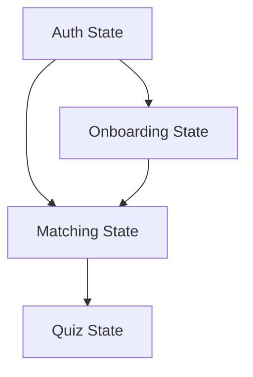

# App.js Decomposition Analysis

## Current Structure Analysis

### Feature Boundaries
1. **Authentication (High Independence)**
   - Login/Register flows
   - Password reset
   - Session management
   - User profile basics
   ```typescript
   // Current locations in App.js
   const [user, setUser] = useState(null);
   const [authError, setAuthError] = useState(null);
   const handleLogin = async () => {...}
   const handleLogout = async () => {...}
   ```

2. **Onboarding (Depends on Auth)**
   - Initial questionnaire
   - Profile completion
   - Preference settings
   ```typescript
   // Current locations in App.js
   const [onboardingStep, setOnboardingStep] = useState(0);
   const [userPreferences, setUserPreferences] = useState({});
   const handleOnboardingComplete = async () => {...}
   ```

3. **Matching (Depends on Auth + Onboarding)**
   - User discovery
   - Match creation
   - Head-to-head setup
   ```typescript
   // Current locations in App.js
   const [matches, setMatches] = useState([]);
   const [activeMatch, setActiveMatch] = useState(null);
   const handleMatchCreate = async () => {...}
   ```

4. **Quiz (Depends on Matching)**
   - Quiz session management
   - Question handling
   - Results display
   ```typescript
   // Current locations in App.js
   const [quizState, setQuizState] = useState({});
   const [quizResults, setQuizResults] = useState(null);
   const handleQuizSubmit = async () => {...}
   ```

### State Dependencies


### Shared Resources
1. **API Clients**
   - AuthAPI
   - MatchingAPI
   - QuizAPI

2. **Utilities**
   - Error handling
   - Data formatting
   - Validation

3. **Common Components**
   - ErrorBoundary ✓
   - LoadingSpinner ✓
   - NetworkStatus ✓

## Extraction Plan

### Phase 1: Setup (Week 1)
1. **Create Feature Module Structure**
   ```bash
   src/features/
     ├── auth/
     ├── onboarding/
     ├── matching/
     └── quiz/
   ```

2. **Setup Shared Resources**
   - **API Client Infrastructure**
     ```typescript
     // src/api/client.ts
     interface IApiClient {
       get<T>(url: string, config?: IRequestConfig): Promise<T>;
       post<T>(url: string, data?: unknown, config?: IRequestConfig): Promise<T>;
       put<T>(url: string, data?: unknown, config?: IRequestConfig): Promise<T>;
       delete<T>(url: string, config?: IRequestConfig): Promise<T>;
     }

     interface IRequestConfig {
       headers?: Record<string, string>;
       params?: Record<string, string>;
       timeout?: number;
       retries?: number;
     }

     class ApiClient implements IApiClient {
       constructor(
         private baseUrl: string,
         private monitoring: MonitoringService
       ) {}

       private async request<T>(config: IFullRequestConfig): Promise<T> {
         const startTime = Date.now();
         try {
           const response = await fetch(/* ... */);
           this.monitoring.trackPerformance({
             apiCall: Date.now() - startTime,
             // ... other metrics
           });
           return response.json();
         } catch (error) {
           this.monitoring.trackError(error, {
             endpoint: config.url,
             method: config.method
           });
           throw error;
         }
       }
     }
     ```

   - **Error Handling Utilities**
     ```typescript
     // src/utils/errors.ts
     interface IAppError extends Error {
       code: string;
       context?: Record<string, unknown>;
       retry?: () => Promise<void>;
     }

     class ApiError extends Error implements IAppError {
       constructor(
         public code: string,
         message: string,
         public context?: Record<string, unknown>
       ) {
         super(message);
       }
     }

     class ValidationError extends Error implements IAppError {
       code = 'VALIDATION_ERROR';
       constructor(
         message: string,
         public fields: Record<string, string[]>
       ) {
         super(message);
       }
     }
     ```

   - **Common Hooks**
     ```typescript
     // src/hooks/useAsync.ts
     function useAsync<T>(
       asyncFn: () => Promise<T>,
       deps: DependencyList = []
     ) {
       const [state, setState] = useState<{
         status: 'idle' | 'pending' | 'success' | 'error';
         data?: T;
         error?: Error;
       }>({
         status: 'idle'
       });

       const execute = useCallback(async () => {
         setState({ status: 'pending' });
         try {
           const data = await asyncFn();
           setState({ status: 'success', data });
         } catch (error) {
           setState({ status: 'error', error: error as Error });
         }
       }, deps);

       return { execute, ...state };
     }

     // src/hooks/useForm.ts
     function useForm<T>(config: IFormConfig<T>) {
       // Form handling with validation and submission
     }
     ```

3. **Testing Infrastructure**
   ```typescript
   // src/testing/test-utils.tsx
   import { render } from '@testing-library/react';
   
   interface ITestProviders {
     auth?: boolean;
     onboarding?: boolean;
     matching?: boolean;
     quiz?: boolean;
   }
   
   function renderWithProviders(
     ui: React.ReactElement,
     { 
       auth = false,
       onboarding = false,
       matching = false,
       quiz = false,
       ...renderOptions
     }: ITestProviders = {}
   ) {
     function Wrapper({ children }: { children: React.ReactNode }) {
       let result = children;
       
       if (quiz) result = <QuizProvider>{result}</QuizProvider>;
       if (matching) result = <MatchingProvider>{result}</MatchingProvider>;
       if (onboarding) result = <OnboardingProvider>{result}</OnboardingProvider>;
       if (auth) result = <AuthProvider>{result}</AuthProvider>;
       
       return <>{result}</>;
     }
     
     return render(ui, { wrapper: Wrapper, ...renderOptions });
   }
   
   // Mock service worker setup
   const handlers = [
     rest.post('/api/auth/login', (req, res, ctx) => {
       return res(ctx.json({ token: 'test-token', user: mockUser }));
     }),
     // ... other API mocks
   ];
   ```

### Phase 2: Auth Feature (Week 1)
1. **Extract Auth Components**
   ```typescript
   // src/features/auth/components/Login.tsx
   interface ILoginProps {
     onSuccess?: () => void;
     onError?: (error: Error) => void;
   }

   const Login: React.FC<ILoginProps> = ({ onSuccess, onError }) => {
     const { login } = useAuth();
     const { execute, status, error } = useAsync(login);
     
     return (
       <Form onSubmit={execute}>
         <TextField name="username" />
         <TextField name="password" type="password" />
         <Button type="submit" loading={status === 'pending'}>
           Login
         </Button>
       </Form>
     );
   };

   // src/features/auth/components/AuthGuard.tsx
   interface IAuthGuardProps {
     children: React.ReactNode;
     fallback?: React.ReactNode;
   }

   const AuthGuard: React.FC<IAuthGuardProps> = ({ children, fallback }) => {
     const { user, isLoading } = useAuth();
     
     if (isLoading) return <LoadingSpinner />;
     if (!user) return fallback || <Login />;
     return <>{children}</>;
   };
   ```

2. **Setup Auth Context**
   ```typescript
   // src/features/auth/services/AuthService.ts
   class AuthService {
     constructor(
       private api: IApiClient,
       private storage: Storage
     ) {}

     async login(credentials: ICredentials): Promise<IUser> {
       const response = await this.api.post<IAuthResponse>('/auth/login', credentials);
       this.storage.setItem('token', response.token);
       return response.user;
     }

     async logout(): Promise<void> {
       await this.api.post('/auth/logout');
       this.storage.removeItem('token');
     }

     async refreshToken(): Promise<string> {
       const response = await this.api.post<IAuthResponse>('/auth/refresh');
       this.storage.setItem('token', response.token);
       return response.token;
     }
   }

   // src/features/auth/context/AuthContext.tsx
   export const AuthProvider: React.FC<{ children: React.ReactNode }> = ({ children }) => {
     const [state, dispatch] = useReducer(authReducer, initialState);
     const authService = useRef(new AuthService(api, localStorage));

     const login = useCallback(async (credentials: ICredentials) => {
       dispatch({ type: 'LOGIN_START' });
       try {
         const user = await authService.current.login(credentials);
         dispatch({ type: 'LOGIN_SUCCESS', payload: user });
       } catch (error) {
         dispatch({ type: 'LOGIN_ERROR', payload: error as Error });
         throw error;
       }
     }, []);

     // ... other methods
   };
   ```

3. **Testing Strategy**
   ```typescript
   // src/features/auth/__tests__/AuthContext.test.tsx
   describe('AuthContext', () => {
     it('should maintain user session', async () => {
       const { result } = renderHook(() => useAuth(), {
         wrapper: AuthProvider
       });
       
       await act(async () => {
         await result.current.login({ username: 'test', password: 'test' });
       });
       
       expect(result.current.user).toBeDefined();
       expect(localStorage.getItem('token')).toBe('test-token');
     });
     
     it('should handle login errors', async () => {
       server.use(
         rest.post('/api/auth/login', (req, res, ctx) => {
           return res(ctx.status(401));
         })
       );
       
       const { result } = renderHook(() => useAuth());
       
       await act(async () => {
         await expect(
           result.current.login({ username: 'test', password: 'wrong' })
         ).rejects.toThrow();
       });
       
       expect(result.current.error).toBeDefined();
     });
   });
   
   // src/features/auth/components/__tests__/Login.test.tsx
   describe('Login', () => {
     it('should handle successful login', async () => {
       const onSuccess = jest.fn();
       const { getByLabelText, getByRole } = renderWithProviders(
         <Login onSuccess={onSuccess} />,
         { auth: true }
       );
       
       await userEvent.type(getByLabelText(/username/i), 'testuser');
       await userEvent.type(getByLabelText(/password/i), 'testpass');
       await userEvent.click(getByRole('button', { name: /login/i }));
       
       expect(onSuccess).toHaveBeenCalled();
     });
     
     it('should show validation errors', async () => {
       const { getByRole, getByText } = renderWithProviders(
         <Login />,
         { auth: true }
       );
       
       await userEvent.click(getByRole('button', { name: /login/i }));
       
       expect(getByText(/username is required/i)).toBeInTheDocument();
     });
     
     it('should show loading state', async () => {
       server.use(
         rest.post('/api/auth/login', async (req, res, ctx) => {
           await delay(100);
           return res(ctx.json({ token: 'test-token', user: mockUser }));
         })
       );
       
       const { getByRole } = renderWithProviders(
         <Login />,
         { auth: true }
       );
       
       await userEvent.click(getByRole('button', { name: /login/i }));
       
       expect(getByRole('button')).toHaveAttribute('disabled');
       expect(getByRole('progressbar')).toBeInTheDocument();
     });
   });
   ```

### Phase 3: Onboarding Feature (Week 2)
1. **Extract Onboarding Components**
   ```typescript
   // Current structure in App.js
   const [onboardingStep, setOnboardingStep] = useState(0);
   const [userPreferences, setUserPreferences] = useState({});
   const handleOnboardingComplete = async () => {...}
   ```

   - OnboardingFlow (Container)
     - Step management
     - Progress tracking
     - Navigation logic
   
   - OnboardingSteps (Components)
     - ProfileSetup
     - PreferencesForm
     - InterestsSelection
     - SkillAssessment

2. **Setup Onboarding Context**
   ```typescript
   interface IOnboardingContext {
     step: number;
     progress: number;
     answers: Record<string, unknown>;
     preferences: IUserPreferences;
     actions: {
       nextStep: () => void;
       prevStep: () => void;
       saveAnswers: (answers: Record<string, unknown>) => Promise<void>;
       completeOnboarding: () => Promise<void>;
     };
   }
   ```

3. **Migration Steps**
   ```typescript
   // 1. Create and wrap with provider
   function App() {
     return (
       <AuthProvider>
         <OnboardingProvider>
           <AppContent />
         </OnboardingProvider>
       </AuthProvider>
     );
   }

   // 2. Replace direct state access
   function OnboardingFlow() {
     const { step, progress, actions } = useOnboarding();
     return (
       <OnboardingContainer>
         <ProgressIndicator value={progress} />
         <StepContent step={step} />
         <NavigationButtons onNext={actions.nextStep} />
       </OnboardingContainer>
     );
   }
   ```

4. **Testing Strategy**
   ```typescript
   // src/features/onboarding/__tests__/OnboardingFlow.test.tsx
   describe('OnboardingFlow', () => {
     it('should progress through steps', async () => {
       const { getByRole, getByText } = renderWithProviders(
         <OnboardingFlow />,
         { auth: true, onboarding: true }
       );
       
       // Step 1: Profile
       await userEvent.type(getByLabelText(/name/i), 'Test User');
       await userEvent.click(getByRole('button', { name: /next/i }));
       
       // Step 2: Preferences
       expect(getByText(/preferences/i)).toBeInTheDocument();
       
       // Verify progress
       expect(getByRole('progressbar')).toHaveAttribute('aria-valuenow', '50');
     });
     
     it('should persist progress', async () => {
       const { unmount } = renderWithProviders(
         <OnboardingFlow />,
         { auth: true, onboarding: true }
       );
       
       // Complete step 1
       await completeStep1();
       
       // Unmount and remount
       unmount();
       
       const { getByText } = renderWithProviders(
         <OnboardingFlow />,
         { auth: true, onboarding: true }
       );
       
       // Should be on step 2
       expect(getByText(/preferences/i)).toBeInTheDocument();
     });
   });
   ```

5. **Integration Points**
   - Auth state dependency
   - Profile data persistence
   - Navigation guards
   - Progress persistence

6. **Verification**
   - Complete flow testing
   - Progress saving/loading
   - Error recovery
   - Performance monitoring

### Phase 4: Matching Feature (Week 2)
1. **Extract Matching Components**
   ```typescript
   // Current structure in App.js
   const [matches, setMatches] = useState([]);
   const [activeMatch, setActiveMatch] = useState(null);
   const [matchPreferences, setMatchPreferences] = useState({});
   ```

   - MatchingContainer
     - Match discovery
     - Preference management
     - Real-time updates
   
   - Components
     - MatchList
     - MatchDetail
     - HeadToHeadSetup
     - MatchChat
     - PreferenceEditor

2. **Setup Matching Context**
   ```typescript
   interface IMatchingContext {
     matches: IMatch[];
     activeMatch: IMatch | null;
     preferences: IMatchPreferences;
     status: 'idle' | 'searching' | 'matched';
     actions: {
       startMatching: () => Promise<void>;
       acceptMatch: (matchId: string) => Promise<void>;
       declineMatch: (matchId: string) => Promise<void>;
       updatePreferences: (prefs: Partial<IMatchPreferences>) => void;
     };
     realtime: {
       subscribe: (matchId: string) => () => void;
       sendMessage: (matchId: string, message: string) => Promise<void>;
     };
   }
   ```

3. **Real-time Integration**
   ```typescript
   class MatchingService {
     private socket: WebSocket;
     private matches: Map<string, IMatch>;
     
     constructor() {
       this.socket = new WebSocket(MATCHING_WS_URL);
       this.setupHandlers();
     }

     public subscribe(matchId: string, callback: (update: IMatchUpdate) => void) {
       // Implementation
     }
   }
   ```

4. **Migration Strategy**
   - Gradual feature flag rollout
   - Socket connection management
   - State synchronization
   - Cache management

5. **Verification**
   - Match creation flow
   - Real-time updates
   - State consistency
   - Network resilience

6. **Testing Strategy**
   ```typescript
   // src/features/matching/__tests__/MatchingContext.test.tsx
   describe('MatchingContext', () => {
     beforeEach(() => {
       // Setup WebSocket mock
       mockWebSocket.setup();
     });

     it('should handle real-time match updates', async () => {
       const { result } = renderHook(() => useMatching(), {
         wrapper: MatchingProvider
       });

       // Simulate match found
       mockWebSocket.emit('match:found', { matchId: '123', user: mockUser });
       
       await waitFor(() => {
         expect(result.current.activeMatch).toBeDefined();
         expect(result.current.status).toBe('matched');
       });
     });

     it('should handle connection drops', async () => {
       const { result } = renderHook(() => useMatching());
       
       // Simulate disconnect
       mockWebSocket.disconnect();
       
       await waitFor(() => {
         expect(result.current.status).toBe('reconnecting');
       });

       // Simulate reconnect
       mockWebSocket.connect();
       
       await waitFor(() => {
         expect(result.current.status).toBe('idle');
       });
     });

     it('should maintain match state during reconnection', async () => {
       const { result } = renderHook(() => useMatching());
       
       // Setup initial match
       await act(async () => {
         await result.current.actions.startMatching();
       });

       const initialMatch = result.current.activeMatch;
       
       // Simulate disconnect/reconnect
       mockWebSocket.disconnect();
       mockWebSocket.connect();
       
       expect(result.current.activeMatch).toEqual(initialMatch);
     });

     // Add polling tests
     describe('Polling', () => {
       it('should poll for match updates at correct intervals', async () => {
         jest.useFakeTimers();
         const { result } = renderHook(() => useMatching());
         
         await act(async () => {
           await result.current.actions.startMatching();
         });

         // Fast-forward past first poll interval
         act(() => {
           jest.advanceTimersByTime(5000);
         });

         expect(mockApi.getMatchStatus).toHaveBeenCalledTimes(2);
       });

       it('should adjust polling frequency based on match state', async () => {
         jest.useFakeTimers();
         const { result } = renderHook(() => useMatching());
         
         // During active matching - frequent polls
         await act(async () => {
           await result.current.actions.startMatching();
           jest.advanceTimersByTime(10000);
         });
         expect(mockApi.getMatchStatus).toHaveBeenCalledTimes(3);

         // After match found - reduced polling
         mockWebSocket.emit('match:found', { matchId: '123' });
         await act(async () => {
           jest.advanceTimersByTime(10000);
         });
         expect(mockApi.getMatchStatus).toHaveBeenCalledTimes(4);
       });
     });

     // Add cross-user interaction tests
     describe('Cross-user Interactions', () => {
       it('should handle concurrent user actions', async () => {
         const { result } = renderHook(() => useMatching());
         
         // User 1 starts match
         await act(async () => {
           await result.current.actions.startMatching();
         });

         // Simulate User 2 accepting
         mockWebSocket.emit('match:action', {
           matchId: '123',
           userId: 'user2',
           action: 'accept'
         });

         await waitFor(() => {
           expect(result.current.activeMatch?.status).toBe('accepted');
           expect(result.current.activeMatch?.participants).toHaveLength(2);
         });
       });

       it('should handle user disconnections during match', async () => {
         const { result } = renderHook(() => useMatching());
         
         // Setup active match
         await act(async () => {
           await result.current.actions.startMatching();
           mockWebSocket.emit('match:found', { 
             matchId: '123',
             participants: [mockUser1, mockUser2]
           });
         });

         // Simulate opponent disconnect
         mockWebSocket.emit('user:disconnect', { userId: mockUser2.id });
         
         await waitFor(() => {
           expect(result.current.activeMatch?.participants[1].status).toBe('disconnected');
         });

         // Simulate opponent reconnect
         mockWebSocket.emit('user:reconnect', { userId: mockUser2.id });
         
         await waitFor(() => {
           expect(result.current.activeMatch?.participants[1].status).toBe('active');
         });
       });

       it('should handle race conditions in match actions', async () => {
         const { result } = renderHook(() => useMatching());
         
         // Both users try to perform actions simultaneously
         await act(async () => {
           // Local user action
           result.current.actions.submitAnswer({ questionId: '1', answer: 'A' });
           
           // Remote user action arrives via websocket
           mockWebSocket.emit('match:action', {
             matchId: '123',
             userId: 'user2',
             action: 'submit',
             data: { questionId: '1', answer: 'B' }
           });
         });

         // Verify both actions were recorded in correct order
         expect(result.current.activeMatch?.answers).toEqual({
           user1: { questionId: '1', answer: 'A', timestamp: expect.any(Number) },
           user2: { questionId: '1', answer: 'B', timestamp: expect.any(Number) }
         });
       });
     });

     // Add state synchronization tests
     describe('State Synchronization', () => {
       it('should reconcile state after reconnection', async () => {
         const { result } = renderHook(() => useMatching());
         
         // Setup initial state
         await act(async () => {
           await result.current.actions.startMatching();
           mockWebSocket.emit('match:found', { matchId: '123' });
         });

         // Simulate disconnect with state changes
         mockWebSocket.disconnect();
         const serverStateChanges = {
           matchId: '123',
           updates: [
             { type: 'answer_submit', data: { userId: 'user2', answer: 'B' } },
             { type: 'score_update', data: { userId: 'user2', score: 10 } }
           ]
         };

         // Reconnect and receive state update
         mockWebSocket.connect();
         mockWebSocket.emit('state:reconcile', serverStateChanges);

         await waitFor(() => {
           expect(result.current.activeMatch?.scores['user2']).toBe(10);
           expect(result.current.activeMatch?.answers['user2']).toBeDefined();
         });
       });

       it('should handle conflicting updates', async () => {
         const { result } = renderHook(() => useMatching());
         
         // Setup match with conflicting updates
         await act(async () => {
           await result.current.actions.startMatching();
           
           // Local update
           result.current.actions.submitAnswer({ questionId: '1', answer: 'A' });
           
           // Server has different state
           mockWebSocket.emit('state:update', {
             matchId: '123',
             answers: {
               [mockUser1.id]: { questionId: '1', answer: 'B' }
             }
           });
         });

         // Verify server state takes precedence
         expect(result.current.activeMatch?.answers[mockUser1.id].answer).toBe('B');
       });
     });
   });

   // src/features/matching/__tests__/MatchList.test.tsx
   describe('MatchList', () => {
     it('should render matches with status indicators', () => {
       const matches = [
         { id: '1', status: 'active', user: mockUser1 },
         { id: '2', status: 'pending', user: mockUser2 }
       ];

       const { getAllByTestId } = renderWithProviders(
         <MatchList matches={matches} />,
         { matching: true }
       );

       const items = getAllByTestId('match-item');
       expect(items).toHaveLength(2);
       expect(items[0]).toHaveAttribute('data-status', 'active');
     });

     it('should handle match selection', async () => {
       const onSelect = jest.fn();
       const { getByText } = renderWithProviders(
         <MatchList onSelect={onSelect} />,
         { matching: true }
       );

       await userEvent.click(getByText(mockUser1.name));
       expect(onSelect).toHaveBeenCalledWith(mockUser1.id);
     });
   });

   // src/features/matching/__tests__/HeadToHead.test.tsx
   describe('HeadToHead', () => {
     it('should synchronize match state', async () => {
       const { getByTestId } = renderWithProviders(
         <HeadToHead matchId="123" />,
         { matching: true }
       );

       // Simulate opponent action
       mockWebSocket.emit('match:action', {
         matchId: '123',
         action: 'ready'
       });

       await waitFor(() => {
         expect(getByTestId('opponent-status')).toHaveTextContent('Ready');
       });
     });

     it('should handle network latency', async () => {
       server.use(
         rest.post('/api/matches/:id/action', async (req, res, ctx) => {
           await delay(1000);
           return res(ctx.json({ status: 'success' }));
         })
       );

       const { getByRole } = renderWithProviders(
         <HeadToHead matchId="123" />,
         { matching: true }
       );

       await userEvent.click(getByRole('button', { name: /ready/i }));
       expect(getByRole('button')).toBeDisabled();
       expect(getByRole('progressbar')).toBeInTheDocument();
     });
   });
   ```

### Phase 5: Quiz Feature (Week 3)
1. **Extract Quiz Components**
   ```typescript
   // Current structure in App.js
   const [quizState, setQuizState] = useState({});
   const [quizResults, setQuizResults] = useState(null);
   const handleQuizSubmit = async () => {...}
   ```

   - QuizContainer
     - Session management
     - Progress tracking
     - Score calculation
   
   - Components
     - QuizHeader
     - QuestionDisplay
     - AnswerInput
     - TimerDisplay
     - ResultsSummary
     - LeaderBoard

2. **Setup Quiz Context**
   ```typescript
   interface IQuizContext {
     session: IQuizSession | null;
     currentQuestion: IQuestion | null;
     answers: Record<string, IAnswer>;
     timeRemaining: number;
     status: 'idle' | 'active' | 'completed';
     actions: {
       startQuiz: (config: IQuizConfig) => Promise<void>;
       submitAnswer: (answer: IAnswer) => Promise<void>;
       endQuiz: () => Promise<IQuizResults>;
     };
     results: {
       score: number;
       correctAnswers: number;
       timeSpent: number;
       ranking: number;
     } | null;
   }
   ```

3. **Timer Implementation**
   ```typescript
   function useQuizTimer(duration: number, onExpire: () => void) {
     const [timeLeft, setTimeLeft] = useState(duration);
     const timerRef = useRef<number>();

     useEffect(() => {
       timerRef.current = window.setInterval(() => {
         setTimeLeft(t => {
           if (t <= 1) {
             clearInterval(timerRef.current);
             onExpire();
             return 0;
           }
           return t - 1;
         });
       }, 1000);

       return () => clearInterval(timerRef.current);
     }, [duration, onExpire]);

     return timeLeft;
   }
   ```

4. **Migration Strategy**
   - Progressive enhancement
   - State persistence
   - Performance optimization
   - Error recovery

5. **Verification**
   - Quiz completion flow
   - Timer accuracy
   - Score calculation
   - Network resilience
   - State recovery
   - Real-time updates

6. **Testing Strategy**
   ```typescript
   // src/features/quiz/__tests__/QuizContext.test.tsx
   describe('QuizContext', () => {
     it('should manage quiz session lifecycle', async () => {
       const { result } = renderHook(() => useQuiz(), {
         wrapper: QuizProvider
       });

       await act(async () => {
         await result.current.actions.startQuiz({ type: 'standard' });
       });

       expect(result.current.status).toBe('active');
       expect(result.current.currentQuestion).toBeDefined();

       await act(async () => {
         await result.current.actions.submitAnswer({
           questionId: '1',
           answer: 'test'
         });
       });

       expect(result.current.answers['1']).toBeDefined();
     });

     it('should handle timer expiration', async () => {
       jest.useFakeTimers();
       
       const { result } = renderHook(() => useQuiz());
       
       await act(async () => {
         await result.current.actions.startQuiz({ 
           type: 'timed',
           duration: 60 
         });
       });

       act(() => {
         jest.advanceTimersByTime(60000);
       });

       expect(result.current.status).toBe('completed');
       expect(result.current.results).toBeDefined();
     });

     // Add real-time synchronization tests
     describe('Real-time Quiz Sync', () => {
       it('should synchronize quiz state between participants', async () => {
         const { result } = renderHook(() => useQuiz());
         
         await act(async () => {
           await result.current.actions.startQuiz({ type: 'head_to_head' });
         });

         // Simulate opponent answer
         mockWebSocket.emit('quiz:answer', {
           userId: 'opponent',
           questionId: '1',
           answer: 'B',
           timeSpent: 5
         });

         await waitFor(() => {
           expect(result.current.opponentProgress).toBe(1);
           expect(result.current.opponentTimeSpent).toBe(5);
         });
       });

       it('should handle answer race conditions', async () => {
         const { result } = renderHook(() => useQuiz());
         
         // Both users answer almost simultaneously
         await act(async () => {
           result.current.actions.submitAnswer({
             questionId: '1',
             answer: 'A',
             timestamp: Date.now()
           });

           // Simulate slightly earlier opponent answer
           mockWebSocket.emit('quiz:answer', {
             userId: 'opponent',
             questionId: '1',
             answer: 'A',
             timestamp: Date.now() - 100
           });
         });

         expect(result.current.answerOrder).toEqual(['opponent', 'user']);
       });
     });

     // Add state recovery tests
     describe('State Recovery', () => {
       it('should restore quiz state after disconnection', async () => {
         const { result } = renderHook(() => useQuiz());
         
         // Setup initial quiz state
         await act(async () => {
           await result.current.actions.startQuiz({ type: 'standard' });
           await result.current.actions.submitAnswer({
             questionId: '1',
             answer: 'A'
           });
         });

         // Simulate disconnect/reconnect
         mockWebSocket.disconnect();
         mockWebSocket.connect();

         await waitFor(() => {
           expect(result.current.answers['1']).toBeDefined();
           expect(result.current.currentQuestion.id).toBe('2');
         });
       });

       it('should handle partial state updates', async () => {
         const { result } = renderHook(() => useQuiz());
         
         await act(async () => {
           await result.current.actions.startQuiz({ type: 'standard' });
         });

         // Simulate partial state update
         mockWebSocket.emit('quiz:state', {
           answers: { '1': { answer: 'A' } },
           currentQuestion: { id: '2' }
         });

         expect(result.current.timeRemaining).toBeDefined();
       });
     });

     // Add performance tests
     describe('Performance', () => {
       it('should batch state updates', async () => {
         const { result } = renderHook(() => useQuiz());
         const renderSpy = jest.spyOn(React, 'createElement');
         
         await act(async () => {
           // Simulate rapid answers
           for (let i = 0; i < 5; i++) {
             mockWebSocket.emit('quiz:answer', {
               userId: `user${i}`,
               questionId: '1',
               answer: 'A'
             });
           }
         });

         // Should batch updates
         expect(renderSpy).toHaveBeenCalledTimes(2);
       });

       it('should debounce state broadcasts', async () => {
         const { result } = renderHook(() => useQuiz());
         const broadcastSpy = jest.spyOn(mockWebSocket, 'send');
         
         await act(async () => {
           // Rapid local state changes
           for (let i = 0; i < 5; i++) {
             result.current.actions.updateProgress(i);
           }
         });

         // Should debounce to single broadcast
         expect(broadcastSpy).toHaveBeenCalledTimes(1);
       });
     });
   });

   // Add shared performance tests
   describe('Performance Tests', () => {
     describe('Matching Performance', () => {
       it('should maintain render performance under load', async () => {
         const { result } = renderHook(() => useMatching());
         performance.mark('matching-start');

         await act(async () => {
           // Simulate 100 rapid match updates
           for (let i = 0; i < 100; i++) {
             mockWebSocket.emit('match:update', {
               matchId: '123',
               participants: generateParticipants(10)
             });
           }
         });

         performance.mark('matching-end');
         const measure = performance.measure(
           'matching-updates',
           'matching-start',
           'matching-end'
         );

         expect(measure.duration).toBeLessThan(100); // 100ms budget
       });

       it('should handle large participant lists efficiently', async () => {
         const { result } = renderHook(() => useMatching());
         const participants = generateParticipants(1000);

         performance.mark('participants-start');
         
         await act(async () => {
           mockWebSocket.emit('match:update', {
             matchId: '123',
             participants
           });
         });

         performance.mark('participants-end');
         const measure = performance.measure(
           'participants-render',
           'participants-start',
           'participants-end'
         );

         expect(measure.duration).toBeLessThan(16); // Single frame budget
       });
     });

     describe('Quiz Performance', () => {
       it('should maintain timer accuracy under load', async () => {
         jest.useFakeTimers();
         const { result } = renderHook(() => useQuiz());
         
         await act(async () => {
           await result.current.actions.startQuiz({
             type: 'timed',
             duration: 60
           });

           // Simulate heavy load
           for (let i = 0; i < 100; i++) {
             mockWebSocket.emit('quiz:update', { /* ... */ });
           }

           jest.advanceTimersByTime(30000); // 30 seconds
         });

         expect(result.current.timeRemaining).toBe(30);
       });

       it('should optimize answer submissions under network latency', async () => {
         const { result } = renderHook(() => useQuiz());
         server.use(
           rest.post('/api/quiz/answer', async (req, res, ctx) => {
             await delay(1000); // High latency
             return res(ctx.json({ status: 'success' }));
           })
         );

         performance.mark('answer-start');
         
         await act(async () => {
           // Submit multiple answers rapidly
           for (let i = 0; i < 5; i++) {
             result.current.actions.submitAnswer({
               questionId: String(i),
               answer: 'A'
             });
           }
         });

         performance.mark('answer-end');
         const measure = performance.measure(
           'answer-submissions',
           'answer-start',
           'answer-end'
         );

         // Should handle high latency gracefully
         expect(measure.duration).toBeLessThan(1200); // 1.2s budget
       });
     });

     describe('Memory Usage', () => {
       it('should clean up resources properly', async () => {
         const { unmount } = renderHook(() => useMatching());
         const initialMemory = performance.memory?.usedJSHeapSize;

         // Create and cleanup 100 matches
         for (let i = 0; i < 100; i++) {
           const { unmount } = renderHook(() => useMatching());
           unmount();
         }

         const finalMemory = performance.memory?.usedJSHeapSize;
         expect(finalMemory - initialMemory).toBeLessThan(1000000); // 1MB budget
       });
     });
   });
   ```

## Verification Strategy

### For Each Feature
1. **State Management**
   - Verify state transitions
   - Check data persistence
   - Validate error handling

2. **User Flows**
   - Test complete journeys
   - Verify edge cases
   - Check error recovery

3. **Performance**
   - Monitor render times
   - Check bundle size
   - Verify network calls

### Integration Points
1. **Feature Interactions**
   - Auth → Onboarding flow
   - Onboarding → Matching flow
   - Matching → Quiz flow

2. **Data Flow**
   - State updates
   - Event handling
   - Error propagation

## Rollback Strategy

1. **Feature Flags**
   ```typescript
   const FEATURES = {
     NEW_AUTH: 'auth-2.0',
     NEW_ONBOARDING: 'onboarding-2.0',
     NEW_MATCHING: 'matching-2.0',
     NEW_QUIZ: 'quiz-2.0'
   };
   ```

2. **State Snapshots**
   - Capture state before migration
   - Verify state after migration
   - Rollback procedures

## Success Metrics
1. **Technical**
   - Bundle size reduction
   - Improved performance
   - Reduced complexity

2. **User Experience**
   - No regression in flows
   - Maintained or improved performance
   - Error handling improvement 